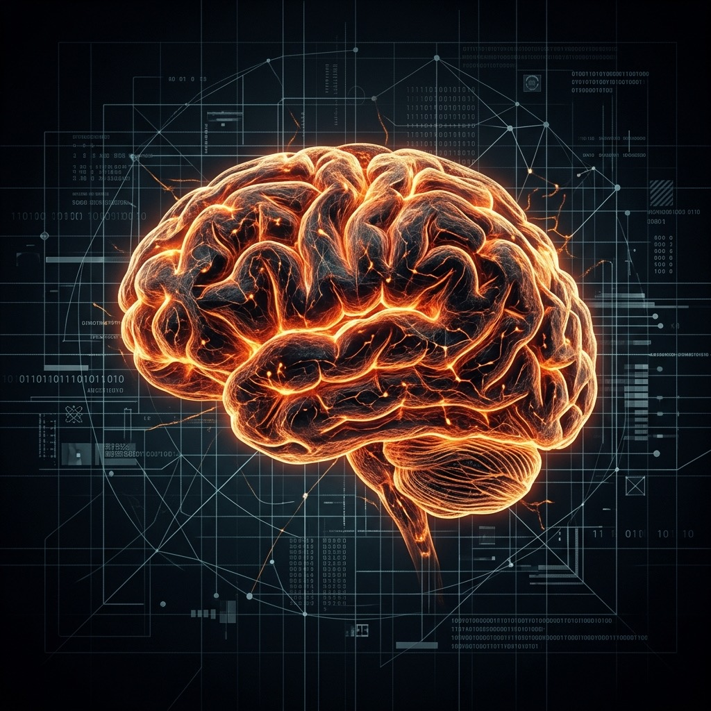

我们正在见证一场无声的“主权交接”。

随着大语言模型（LLM）和自主智能体（Agents）渗透到工作与生活的每个角落，外包任务的边界正在发生根本性的迁移。我们从最初外包“体力劳动”（如计算、打字、排版），演变到开始外包<strong>“认知劳动”</strong>——让 AI 帮我们阅读长文、总结报告、撰写邮件，甚至帮我们做决策。

这种现象，我称之为<strong>“认知外包”（Cognitive Outsourcing）</strong>。

认知外包看起来是一种极致的效率杠杆，但其背后隐藏着一个巨大的陷阱：当你习惯性地将思考、推理和整合的过程让渡给机器时，你的大脑神经网络正在悄然萎缩。

## 认知外包的代价：被平庸均值吞噬

为什么依赖 AI 进行思考会带来危险？

大语言模型的本质，是基于人类既有互联网文本的<strong>统计概率均值预测</strong>。当你把阅读、分析和决策外包给 AI 时，你获得的产物本质上是“大众平均认知”的映射。

如果你写出来的代码、做出的业务决策、甚至写给朋友的信件，全部来自 AI 润色和生成的标准模板，你的独特性就在被“均值化”。你的“Taste”（品味）和“Edge”（竞争壁垒）将被统计分布的中心曲线无情抹平。

更危险的是<strong>“能力幻觉”</strong>。读一篇 AI 生成的 200 字摘要，会让你产生“我读懂了这本 20 万字书”的错觉。但实际上，没有经历过痛苦的阅读阻碍、没有进行过观点交锋和神经突触的重构，这些知识根本没有进入你的长期记忆。它属于机器，不属于你。

> “技术可以扩增能力，但品味和直觉决定价值。如果你的自主思考是零，被无限外包放大后依然是零。”

---

## 如何建立个人的 Ground Truth 认知体系

为了在 AI 时代保持主权，你必须建立属于自己的 **Ground Truth（地面真理/真实基准）** 认知体系。

在机器学习中，Ground Truth 指的是未经过滤、可供校验的真实世界观测数据。对于人类来说，建立 Ground Truth 认知体系意味着：<strong>拒绝二手均值知识，直达客观世界反馈。</strong>

以下是三条具体的践行路径：

### 1. 直达第一性原理与原始语料
不要只看 AI 的总结。去阅读原著、去阅读第一手的学术论文、去翻看底层源码。在接触 AI 的提炼之前，先用自己大脑的神经元去碰撞最原始的语料，形成属于你自己的第一道思想痕迹。

### 2. 建立“高频低度”的实践反馈回路
AI 时代的学习，不能只停留在“输入”层面。你需要通过实践去校验你的认知：
*   **动手写 scratch 代码**，而不是只看着 AI 生成的页面；
*   **做真实的业务测试**，亲手去和用户交流；
*   **坚持输出长文和文章**。在用文字表达思想的过程中，大脑才在进行真正的逻辑自洽训练。

### 3. 把 AI 当作“磨刀石”，而非“代笔人”
优秀的重塑者不会把 AI 当成帮自己写结论的秘书，而是把 AI 当成自己逻辑的<strong>“蓝军”</strong>和<strong>“磨刀石”</strong>。
*   当你形成一个观点时，你可以对 AI 说：*“这是我的论点，请扮演一个刻薄的批评家，找出我逻辑中的 5 个致命漏洞。”*
*   在与 AI 的激烈辩论中，你自己的认知体系才会被打磨得更加坚韧。

---

## 学术界关于“认知外包”的权威论证

把思考让渡给外部工具（学术界统称为 <strong>认知卸载/Cognitive Offloading</strong>）并不是一种毫无代价的免费午餐。认知科学、心理学与神经科学多年的实证研究，已经为我们揭示了过度“外包”大脑功能所要付出的高昂代价：

### 1. “谷歌效应”与数字化失忆（Digital Amnesia）
哈佛大学与哥伦比亚大学发表于《科学》（Science）杂志的经典研究指出，当人类大脑知道某些信息可以被外部工具（如搜索引擎或 AI）持久保存时，它会主动降低对这些信息本身的记忆编码（Memory Encoding），而只记住“去哪里能找到它”。过度依赖 AI 整理，会直接损害大脑的长期工作记忆（Working Memory）。

### 2. 知识通胀的幻觉（Illusion of Knowledge）
耶鲁大学学者发表于《实验心理学杂志》（Journal of Experimental Psychology）的实证研究表明，频繁向外部系统获取解释的人，会产生一种认知偏误：<strong>将“获取知识的能力”误认为是“自己拥有这门知识”</strong>。这会导致个人产生过度自信，从而终止深度的、长期的技能探索。

### 3. 用进废退：神经元连接的实质性减弱
滑铁卢大学认知科学研究者 Evan F. Risko 与伦敦大学学院的 Sam Gilbert 在《认知科学趋势》（Trends in Cognitive Sciences）发表的综述中指出，长期的认知卸载会弱化人类的元认知（Metacognition）能力。MIT 针对大语言模型辅助协作的最新神经脑电（EEG）实验甚至发现，过度依赖 AI 起草和构思的受试者，在长期写作任务中的脑神经活跃度与整体脑区间协同效率呈现明显下滑趋势，其内在的心智敏捷度被实质性削弱。

---

## 结语：保护你的认知主权

在人人都在“认知外包”的洪流中，那些坚持自主思考、用实践构建 Ground Truth 体系的人，将成为极度稀缺的<strong>“认知源头”</strong>。

技术应当是人类心智的放大器，而不应是心智的替代品。在软件统治一切的时代，保护好你的认知主权，才是你重塑自我、走向卓越的终极壁垒。

---

## 参考文献与学术源链接

- [1] Sparrow, B., Liu, J., & Wegner, D. M. (2011). **Google Effects on Memory: Cognitive Consequences of Having Information at Our Fingertips.** *Science*. [点击阅读 Science 论文原文](https://www.science.org/doi/10.1126/science.1207745)
- [2] Fisher, M., Oppenheimer, D. M., & Keil, F. C. (2015). **Searching for Explanations: How the Internet Inflates Estimates of Internal Knowledge.** *Journal of Experimental Psychology: General*. [点击阅读 APA PsycNet 论文原文](https://psycnet.apa.org/doiLanding?doi=10.1037%2Fxge0000070)
- [3] Risko, E. F., & Gilbert, S. J. (2016). **Cognitive Offloading.** *Trends in Cognitive Sciences*. [点击阅读 Cell Press 论文原文](https://doi.org/10.1016/j.tics.2016.07.007)
- [4] Noy, S., & Zhang, W. (2023). **Experimental Evidence on the Productivity Effects of Generative Artificial Intelligence.** *Science / MIT Research*. [点击阅读 Science 论文原文](https://www.science.org/doi/10.1126/science.adh2586)

